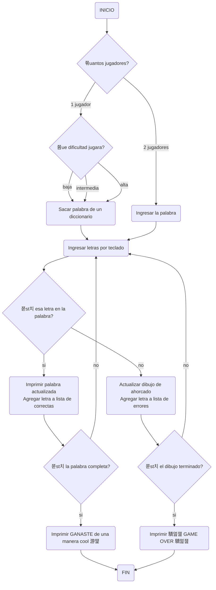

# Proyecto / Juego de Ahorcado
### Planeaci칩n c칩digo de juego de ahorcado
Un juego de ahorcado es algo que cualquiera puede imaginarse que es divertido de hacer en un momento de aburrimiento, por lo cual nosotros los LegoCoders hemos decidido crear un programa el cual te permita jugar ahorcado tanto solo como con un amigo.

Pero antes que nada vamos a demostrar el procedimiento que seguimos para crearlo.

### Diagrama de Flujo
El diagrama de flujo nos ayudara a dimensionar cual es el objetivo que debemos alcanzar y mostrar el camino que se debe seguir. As칤 que este es el diagrama de flujo:

