# Proyecto / Juego de Ahorcado
### Planeación código de juego de ahorcado
Un juego de ahorcado es algo que cualquiera puede imaginarse que es divertido de hacer en un momento de aburrimiento, por lo cual nosotros los LegoCoders hemos decidido crear un programa el cual te permita jugar ahorcado tanto solo como con un amigo.

Pero antes que nada vamos a demostrar el procedimiento que seguimos para crearlo.

### Diagrama de Flujo
El diagrama de flujo nos ayudara a dimensionar cual es el objetivo que debemos alcanzar y mostrar el camino que se debe seguir. Así que este es el diagrama de flujo:

```mermaid
graph TD;
  A(INICIO) --> B{¿Cuantos jugadores?}
  B-->|1 jugador|C{¿Que dificultad jugara?}
  B-->|2 jugadores|E(Ingresar la palabra)
  C-->|baja|D(Sacar palabra de un diccionario)
  C-->|intermedia|D
  C-->|alta|D
  D-->F
  E-->F(Ingresar letras por teclado)
  F-->G{¿Está esa letra en la palabra?}
  G-->|si|H(Imprimir palabra actualizada)
  G-->|no|I(Actualizar dibujo de ahorcado
      Agregar letra a lista de errores)
  H-->J{¿Está la palabra completa?}
  J-->|si|K(Imprimir GANASTE de una manera cool 😎)
  K-->L(Calcular puntaje)
  J-->|no|F
  I-->N{¿Está el dibujo terminado?}
  N-->|si|M(Imprimir ☠️ GAME OVER ☠️)
  M-->L
  N-->|no|F
  L-->O(FIN)

```


### Explicacion del diagrama de flujo

#### 1. Inicio del juego
- INICIO

#### 2. Número de jugadores

- Seleccionar número de jugadores
1 jugador
2 jugadores

#### 3.Elegir dificultad
Elegir dificultad del juego

- Baja
- Intermedia
- Alta

#### 4. Seleccionar o ingresar la palabra

- Para 1 jugador: Seleccionar palabra del diccionario

- Para 2 jugadores: Ingresar la palabra

#### 5. Ingresar letras

- Ingresar letras por teclado

#### 6. Verificación de letras

Comprobar si la letra está en la palabra

Sí:
Actualizar palabra mostrada, 
Verificar si la palabra está completa,
Sí: Mostrar mensaje de victoria y calcular puntaje.
No: Continuar ingresando letras.
No
Actualizar dibujo del ahorcado y lista de errores
Verificar si el dibujo del ahorcado está completo

#### - Sí: Mostrar mensaje de derrota y calcular puntaje

#### - No: Continuar ingresando letras

#### 7.Mensajes finales y puntaje

Mostrar mensaje final y calcular puntaje
Victoria: GANASTE 😎 
Derrota: GAME OVER ☠️

#### 8.Fin del juego

FIN

```py
def adivinar_palabra (p_org=list, p_obs=list, palabra=str, letras_erroneas=list)->int:

    i : int = 0
   
    while i < 12:
        p_obs1 = " ".join(p_obs)
        print (p_obs1)
        a = (input("Escriba una letra: "))
        if a in palabra:
            for e in range (len(palabra)):
                if a == p_org[e]:
                    p_obs[e] = a
        else:
            i += 1
        if p_org == p_obs:
            break
    print (p_obs1)
    if p_org == p_obs:
        resultado = 1
    else:
        resultado = 0

    return resultado


if __name__ == "__main__":
    # Palabra para jugar
    palabra = input("Ingrese la palabra en minúsculas para jugar: ")
    #Listas para la función
    p_org = []
    p_obs = []
    letras_erroneas = []
    #Asignación de elementos contenidos en listas
    for i in range (len(palabra)):
        p_org.append (palabra[i])
        p_obs.append ("__")

resultado = adivinar_palabra(p_org, p_obs, palabra)


if resultado == 1:
    print ("GANASTE")
else:
    print("GAME OVER")
```
cosas faltantes:
tiempo
lista de letras erroneas que se ingresen
puntaje

#### ANEXOS AL CODIGO

```py
def adivinar_palabra(p_org=list, p_obs=list, palabra=str, letras_erroneas=list) -> int:
    i: int = 0
    puntaje: int = 100  # Puntaje inicial

    while i < 12:
        p_obs1 = " ".join(p_obs)
        print(p_obs1)
        print(f"Intentos restantes: {12 - i}")
        print(f"Letra(s) errónea(s): {', '.join(letras_erroneas)}")
        
        a = input("Escriba una letra: ").lower()
        
        if a in palabra:
            for e in range(len(palabra)):
                if a == p_org[e]:
                    p_obs[e] = a
        else:
            i += 1
            if a not in letras_erroneas:
                letras_erroneas.append(a)
        
        if p_org == p_obs:
            break
        
        # Penaliza el puntaje por cada intento fallido
        puntaje -= 10
    
    print(" ".join(p_obs))
    
    if p_org == p_obs:
        resultado = 1
    else:
        resultado = 0

    return resultado, puntaje

if __name__ == "__main__":
    # Palabra para jugar
    palabra = input("Ingrese la palabra en minúsculas para jugar: ").lower()
    
    # Listas para la función
    p_org = []
    p_obs = []
    letras_erroneas = []
    
    # Asignación de elementos contenidos en listas
    for i in range(len(palabra)):
        p_org.append(palabra[i])
        p_obs.append("__")

    resultado, puntaje = adivinar_palabra(p_org, p_obs, palabra, letras_erroneas)

    if resultado == 1:
        print("GANASTE")
    else:
        print("GAME OVER")

    print(f"Tu puntaje es: {puntaje}")
```
Explicación de las modificaciones:

Cuenta regresiva:
Se muestra el número de intentos restantes en cada iteración del bucle while usando (print(f"Intentos restantes: {12 - i}").)

Manejo de puntajes:
Se inicializa una variable puntaje al principio del juego para llevar un registro del puntaje del jugador.
El puntaje comienza en 100 y se penaliza con 10 puntos por cada intento fallido.
Se actualiza el puntaje en cada iteración del bucle (while) si el jugador falla un intento.
Se imprime el puntaje final al final del juego.

OTRO ANEXO 

```py
def mostrar_horcas(intentos: int):
    """Muestra la figura del ahorcado basada en el número de intentos fallidos."""
    etapas = [
        """
         ------
         |    |
              |
              |
              |
              |
        =========
        """,
        """
         ------
         |    |
         O    |
              |
              |
              |
        =========
        """,
        """
         ------
         |    |
         O    |
         |    |
              |
              |
        =========
        """,
        """
         ------
         |    |
         O    |
        /|    |
              |
              |
        =========
        """,
        """
         ------
         |    |
         O    |
        /|\\   |
              |
              |
        =========
        """,
        """
         ------
         |    |
         O    |
        /|\\   |
        /     |
              |
        =========
        """,
        """
         ------
         |    |
         O    |
        /|\\   |
        / \\   |
              |
        =========
        """
    ]
    print(etapas[intentos])

def adivinar_palabra(p_org=list, p_obs=list, palabra=str, letras_erroneas=list) -> int:
    i: int = 0
    puntaje: int = 100  # Puntaje inicial

    while i < 6:  # Número total de intentos fallidos permitidos
        mostrar_horcas(i)
        
        # Mostrar la línea con las letras adivinadas y los guiones bajos para las letras restantes
        p_obs1 = " ".join(p_obs)
        print(f"Línea actual: {p_obs1}")
        
        print(f"Intentos restantes: {6 - i}")
        print(f"Letra(s) errónea(s): {', '.join(letras_erroneas)}")
        
        a = input("Escriba una letra: ").lower()
        
        if a in palabra:
            for e in range(len(palabra)):
                if a == p_org[e]:
                    p_obs[e] = a
        else:
            i += 1
            if a not in letras_erroneas:
                letras_erroneas.append(a)
             puntaje -= 10 # Penaliza el puntaje por cada intento fallido

        if p_org == p_obs:
            break
    
    mostrar_horcas(i)  # Muestra el estado final del ahorcado
    
    print(f"Línea final: {' '.join(p_obs)}")
    
    if p_org == p_obs:
        resultado = 1
    else:
        resultado = 0

    return resultado, puntaje

if __name__ == "__main__":
    # Palabra para jugar (modificada a "computador")
    palabra = "computador"
    
    # Listas para la función
    p_org = []
    p_obs = []
    letras_erroneas = []
    
    # Asignación de elementos contenidos en listas
    for i in range(len(palabra)):
        p_org.append(palabra[i])
        p_obs.append("__")

    resultado, puntaje = adivinar_palabra(p_org, p_obs, palabra, letras_erroneas)

    if resultado == 1:
        print("GANASTE")
    else:
        print("GAME OVER")

    print(f"Tu puntaje es: {puntaje}")
```
Cambios Realizados

1. Incorporación del Ahorcado:

Función mostrar_horcas: Se ha agregado una nueva función llamada mostrar_horcas para mostrar la representación gráfica del ahorcado según el número de intentos fallidos. Esta función imprime diferentes etapas del ahorcado (de la base hasta el muñeco completo). 

2. Actualización de la Función adivinar_palabra:

Número de Intentos: Se ha cambiado el número de intentos permitidos a 6, en lugar de 12.

Puntaje: Se ha añadido un sistema de puntajes que disminuye con cada intento fallido.

Visualización del Ahorcado y Línea de Palabra: La función ahora muestra la línea con los caracteres adivinados y el estado actual del ahorcado en cada iteración.

3. Actualización en el Bloque Principal (__main__):

Palabra Predeterminada: Se ha fijado la palabra a adivinar como "computador" en lugar de solicitarla al usuario.

Puntaje: Se muestra el puntaje final al final del juego.


ULTIMA ACTUALIZACION

```py
import tkinter as tk

class AhorcadoApp:
    def __init__(self, root):
        self.root = root
        self.root.title("Juego del Ahorcado")

        self.palabra = "computador"
        self.p_org = [char for char in self.palabra]
        self.p_obs = ["__" for _ in self.palabra]
        self.letras_erroneas = []
        self.intentos = 0
        self.puntaje = 100

        # Configuración del lienzo para el dibujo del ahorcado
        self.canvas = tk.Canvas(root, width=200, height=200, bg="white")
        self.canvas.pack()
        self.dibujar_horcas()

        # Configuración de la interfaz
        self.palabra_label = tk.Label(root, text=" ".join(self.p_obs), font=("Courier", 14))
        self.palabra_label.pack()

        self.intentos_label = tk.Label(root, text=f"Intentos restantes: {6 - self.intentos}", font=("Courier", 14))
        self.intentos_label.pack()

        self.letras_erroneas_label = tk.Label(root, text="Letra(s) errónea(s): ", font=("Courier", 14))
        self.letras_erroneas_label.pack()

        self.entrada = tk.Entry(root)
        self.entrada.pack()

        self.adivinar_button = tk.Button(root, text="Adivinar", command=self.adivinar)
        self.adivinar_button.pack()

    def adivinar(self):
        letra = self.entrada.get().lower()
        if letra in self.palabra:
            for idx, char in enumerate(self.palabra):
                if letra == char:
                    self.p_obs[idx] = letra
        else:
            if letra not in self.letras_erroneas:
                self.letras_erroneas.append(letra)
                self.intentos += 1
                self.puntaje -= 10
                self.dibujar_horcas()
        
        self.actualizar_interfaz()
        
        if self.p_org == self.p_obs:
            self.mostrar_resultado("GANASTE")
        elif self.intentos >= 6:
            self.mostrar_resultado("GAME OVER")

    def dibujar_horcas(self):
        self.canvas.delete("all")
        
        # Dibujo del ahorcado en función de los intentos fallidos
        if self.intentos > 0:
            # Base y poste
            self.canvas.create_line(50, 150, 150, 150, width=2)
            self.canvas.create_line(70, 150, 70, 50, width=2)
            self.canvas.create_line(70, 50, 120, 50, width=2)
            self.canvas.create_line(120, 50, 120, 80, width=2)
        
        if self.intentos > 1:
            # Cabeza
            self.canvas.create_oval(100, 80, 140, 120, outline="black", width=2)
        
        if self.intentos > 2:
            # Cuerpo
            self.canvas.create_line(120, 120, 120, 150, width=2)
        
        if self.intentos > 3:
            # Brazo izquierdo
            self.canvas.create_line(120, 130, 100, 110, width=2)
        
        if self.intentos > 4:
            # Brazo derecho
            self.canvas.create_line(120, 130, 140, 110, width=2)
        
        if self.intentos > 5:
            # Pierna izquierda
            self.canvas.create_line(120, 150, 100, 170, width=2)
        
        if self.intentos > 6:
            # Pierna derecha
            self.canvas.create_line(120, 150, 140, 170, width=2)

    def actualizar_interfaz(self):
        self.palabra_label.config(text=" ".join(self.p_obs))
        self.intentos_label.config(text=f"Intentos restantes: {6 - self.intentos}")
        self.letras_erroneas_label.config(text=f"Letra(s) errónea(s): {', '.join(self.letras_erroneas)}")

    def mostrar_resultado(self, mensaje):
        resultado_ventana = tk.Toplevel(self.root)
        resultado_ventana.title("Resultado")
        
        resultado_label = tk.Label(resultado_ventana, text=f"{mensaje}. Tu puntaje final es: {self.puntaje}", font=("Courier", 14))
        resultado_label.pack(padx=20, pady=20)
        
        cerrar_button = tk.Button(resultado_ventana, text="Cerrar", command=self.root.quit)
        cerrar_button.pack(pady=10)

        # Desactiva la entrada y el botón de adivinanza
        self.entrada.config(state="disabled")
        self.adivinar_button.config(state="disabled")

if __name__ == "__main__":
    root = tk.Tk()
    app = AhorcadoApp(root)
    root.mainloop()

```
