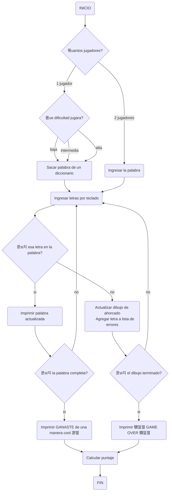

# Proyecto / Juego de Ahorcado
### Planeación código de juego de ahorcado
Un juego de ahorcado es algo que cualquiera puede imaginarse que es divertido de hacer en un momento de aburrimiento, por lo cual nosotros los LegoCoders hemos decidido crear un programa el cual te permita jugar ahorcado tanto solo como con un amigo.

Pero antes que nada vamos a demostrar el procedimiento que seguimos para crearlo.

### Diagrama de Flujo
El diagrama de flujo nos ayudara a dimensionar cual es el objetivo que debemos alcanzar y mostrar el camino que se debe seguir. Así que este es el diagrama de flujo:


### Explicacion del diagrama de flujo

#### 1. Inicio del juego
- INICIO

#### 2. Número de jugadores

- Seleccionar número de jugadores
1 jugador
2 jugadores

#### 3.Elegir dificultad
Elegir dificultad del juego

- Baja
- Intermedia
- Alta

#### 4. Seleccionar o ingresar la palabra

- Para 1 jugador: Seleccionar palabra del diccionario

- Para 2 jugadores: Ingresar la palabra

#### 5. Ingresar letras

- Ingresar letras por teclado

#### 6. Verificación de letras

Comprobar si la letra está en la palabra

Sí
Actualizar palabra mostrada
Verificar si la palabra está completa
Sí: Mostrar mensaje de victoria y calcular puntaje
No: Continuar ingresando letras
No
Actualizar dibujo del ahorcado y lista de errores
Verificar si el dibujo del ahorcado está completo

#### - Sí: Mostrar mensaje de derrota y calcular puntaje

#### - No: Continuar ingresando letras

#### 7.Mensajes finales y puntaje

Mostrar mensaje final y calcular puntaje
Victoria: GANASTE 😎
Derrota: GAME OVER ☠️

#### 8.Fin del juego

FIN

```py
def adivinar_palabra (p_org=list, p_obs=list, palabra=str, letras_erroneas=list)->int:

    i : int = 0
   
    while i < 12:
        p_obs1 = " ".join(p_obs)
        print (p_obs1)
        a = (input("Escriba una letra: "))
        if a in palabra:
            for e in range (len(palabra)):
                if a == p_org[e]:
                    p_obs[e] = a
        else:
            i += 1
        if p_org == p_obs:
            break
    print (p_obs1)
    if p_org == p_obs:
        resultado = 1
    else:
        resultado = 0

    return resultado


if __name__ == "__main__":
    # Palabra para jugar
    palabra = input("Ingrese la palabra en minúsculas para jugar: ")
    #Listas para la función
    p_org = []
    p_obs = []
    letras_erroneas = []
    #Asignación de elementos contenidos en listas
    for i in range (len(palabra)):
        p_org.append (palabra[i])
        p_obs.append ("__")

resultado = adivinar_palabra(p_org, p_obs, palabra)


if resultado == 1:
    print ("GANASTE")
else:
    print("GAME OVER")
```
cosas faltantes:
tiempo
lista de letras erroneas que se ingresen
puntaje

#### ANEXOS AL CODIGO

```py
def adivinar_palabra(p_org=list, p_obs=list, palabra=str, letras_erroneas=list) -> int:
    i: int = 0
    puntaje: int = 100  # Puntaje inicial

    while i < 12:
        p_obs1 = " ".join(p_obs)
        print(p_obs1)
        print(f"Intentos restantes: {12 - i}")
        print(f"Letra(s) errónea(s): {', '.join(letras_erroneas)}")
        
        a = input("Escriba una letra: ").lower()
        
        if a in palabra:
            for e in range(len(palabra)):
                if a == p_org[e]:
                    p_obs[e] = a
        else:
            i += 1
            if a not in letras_erroneas:
                letras_erroneas.append(a)
        
        if p_org == p_obs:
            break
        
        # Penaliza el puntaje por cada intento fallido
        puntaje -= 10
    
    print(" ".join(p_obs))
    
    if p_org == p_obs:
        resultado = 1
    else:
        resultado = 0

    return resultado, puntaje

if __name__ == "__main__":
    # Palabra para jugar
    palabra = input("Ingrese la palabra en minúsculas para jugar: ").lower()
    
    # Listas para la función
    p_org = []
    p_obs = []
    letras_erroneas = []
    
    # Asignación de elementos contenidos en listas
    for i in range(len(palabra)):
        p_org.append(palabra[i])
        p_obs.append("__")

    resultado, puntaje = adivinar_palabra(p_org, p_obs, palabra, letras_erroneas)

    if resultado == 1:
        print("GANASTE")
    else:
        print("GAME OVER")

    print(f"Tu puntaje es: {puntaje}")
```
Explicación de las modificaciones:

Cuenta regresiva:
Se muestra el número de intentos restantes en cada iteración del bucle while usando (print(f"Intentos restantes: {12 - i}").)

Manejo de puntajes:
Se inicializa una variable puntaje al principio del juego para llevar un registro del puntaje del jugador.
El puntaje comienza en 100 y se penaliza con 10 puntos por cada intento fallido.
Se actualiza el puntaje en cada iteración del bucle (while) si el jugador falla un intento.
Se imprime el puntaje final al final del juego.
