# Proyecto / Juego de Ahorcado
### Planeación código de juego de ahorcado
Un juego de ahorcado es algo que cualquiera puede imaginarse que es divertido de hacer en un momento de aburrimiento, por lo cual nosotros los LegoCoders hemos decidido crear un programa el cual te permita jugar ahorcado tanto solo como con un amigo.

Pero antes que nada vamos a demostrar el procedimiento que seguimos para crearlo.

### Diagrama de Flujo
El diagrama de flujo nos ayudara a dimensionar cual es el objetivo que debemos alcanzar y mostrar el camino que se debe seguir. Así que este es el diagrama de flujo:

```mermaid
graph TD;
  A(INICIO) --> B{¿Cuántos jugadores?}
  B-->|1 jugador|C{¿Qué dificultad jugará?}
  B-->|2 jugadores|E(Iniciar multijugador)
  
  C-->|fácil|D(Sacar palabra de un diccionario)
  C-->|medio|D
  C-->|difícil|D
  
  D-->F{¿Qué idioma?}
  F-->|español|G(Sacar palabra en español)
  F-->|inglés|G(Sacar palabra en inglés)
  F-->|francés|G(Sacar palabra en francés)
  F-->|alemán|G(Sacar palabra en alemán)

  G-->H(Ingresar letras por teclado)
  E-->H

  H-->I{¿Está esa letra en la palabra?}
  I-->|sí|J(Imprimir palabra actualizada)
  I-->|no|K(Actualizar dibujo de ahorcado<br>Agregar letra a lista de errores)

  J-->L{¿Está la palabra completa?}
  L-->|sí|M(Imprimir GANASTE de una manera cool 😎)
  M-->N(Calcular puntaje)
  L-->|no|H

  K-->O{¿Está el dibujo terminado?}
  O-->|sí|P(Imprimir ☠️ GAME OVER ☠️)
  P-->N
  O-->|no|H
  
  N-->Q(FIN)

```


## Explicación del diagrama de flujo

### 1. Inicio del juego

INICIO: El juego comienza.

### 2. Número de jugadores
¿Cuántos jugadores?: Se pregunta cuántos jugadores participarán en el juego.
- 1 jugador: Si hay un solo jugador, se procede a elegir la dificultad.
- 2 jugadores: Si hay dos jugadores, se inicia la modalidad multijugador.

### 3. Elegir dificultad
¿Qué dificultad jugará?: Si hay un solo jugador, se le pregunta sobre la dificultad del juego.

- fácil: La dificultad se establece en fácil, y se sacará una palabra de un diccionario.
- medio: La dificultad se establece en medio, y se sacará una palabra de un diccionario.
- difícil: La dificultad se establece en difícil, y se sacará una palabra de un diccionario.

  ### 4. Elegir idioma
  Hay 4 opciones de idioma para la palabra que se va a adivinar
-Español
-Ingles
-Frances
-Aleman
  

### 5. Seleccionar palabra
Sacar palabra de un diccionario: Se selecciona una palabra del diccionario según la dificultad elegida.

- Iniciar multijugador: Los dos jugadores ingresan la palabra.

### 6. Ingresar letras
- Ingresar letras por teclado: Los jugadores comienzan a ingresar letras en un intento de adivinar la palabra.

### 7. Verificación de letras

- ¿Está esa letra en la palabra?: Se verifica si la letra ingresada está en la palabra.

Sí:

Imprimir palabra actualizada: Se actualiza la visualización de la palabra mostrando las letras adivinadas correctamente.

- ¿Está la palabra completa?: Se verifica si el jugador ha adivinado todas las letras de la palabra.

Sí:

- Imprimir GANASTE de una manera cool 😎: Se muestra un mensaje de victoria.

- Calcular puntaje: Se calcula el puntaje obtenido por el jugador.

- No: Se vuelve a solicitar la entrada de letras.

No:

Actualizar dibujo de ahorcado: Se incrementa el estado del ahorcado y se agrega la letra a la lista de errores.

¿Está el dibujo terminado?: Se verifica si el dibujo del ahorcado ha llegado a su final.

Sí:

- Imprimir ☠️ GAME OVER ☠️: Se muestra un mensaje de derrota.
- Se calcula el puntaje.
  
No: 
Se vuelve a solicitar la entrada de letras.

### 8. Final del juego

FIN: Se concluye el juego.


## CODIGO DEL AHORCADO.PY

```py
import random
import time

# Definir los niveles de dificultad
DIFFICULTY_LEVELS = {
    'fácil': 8,
    'medio': 6,
    'difícil': 4
}

# Dibujos del ahorcado en ASCII
HANGMAN_PICS = [
    '''
     +---+
     |   |
         |
         |
         |
         |
    =========''', '''
     +---+
     |   |
     O   |
         |
         |
         |
    =========''', '''
     +---+
     |   |
     O   |
     |   |
         |
         |
    =========''', '''
     +---+
     |   |
     O   |
    /|   |
         |
         |
    =========''', '''
     +---+
     |   |
     O   |
    /|\\  |
         |
         |
    =========''', '''
     +---+
     |   |
     O   |
    /|\\  |
    /    |
         |
    =========''', '''
     +---+
     |   |
     O   |
    /|\\  |
    / \\  |
         |
    ========='''
]

# Cargar palabras desde un archivo para diferentes idiomas
def load_words(language):
    try:
        with open(f'words_{language}.txt', 'r', encoding='utf-8') as file:
            return file.read().splitlines()
    except FileNotFoundError:
        print(f"Archivo words_{language}.txt no encontrado. Verifica que esté en la misma carpeta que el script.")
        return []
    except UnicodeDecodeError:
        print(f"Error de codificación al leer el archivo words_{language}.txt. Asegúrate de que esté en UTF-8.")
        return []

# Seleccionar una palabra aleatoria
def select_word(words):
    return random.choice(words).lower()

# Juego principal con cuenta regresiva y manejo de puntajes
def play_game(word, max_attempts):
    guessed = "_" * len(word)
    attempts = 0
    guessed_letters = []
    score = 0
    start_time = time.time()
    
    while attempts < max_attempts and "_" in guessed:
        print(HANGMAN_PICS[attempts])
        print(f"Palabra: {guessed}")
        print(f"Letras adivinadas: {', '.join(guessed_letters)}")
        print(f"Intentos restantes: {max_attempts - attempts}")
        
        # Tiempo restante (cuenta regresiva)
        elapsed_time = time.time() - start_time
        time_left = max(0, 50 - int(elapsed_time))
        print(f"Tiempo restante: {time_left} segundos")
        
        if time_left == 0:
            print("¡Se acabó el tiempo!")
            break
        
        guess = input("Adivina una letra: ").lower()
        
        if guess in guessed_letters:
            print("Ya has adivinado esa letra. Intenta de nuevo.")
            continue
        
        guessed_letters.append(guess)
        
        if guess in word:
            guessed = ''.join([guess if word[i] == guess else guessed[i] for i in range(len(word))])
            print("¡Correcto!")
        else:
            attempts += 1
            print("Incorrecto.")
    
    # Resultado al final del tiempo o intentos
    if "_" not in guessed:
        score += 10 * (max_attempts - attempts)  # Puntaje basado en los intentos restantes
        print(f"¡Ganaste! La palabra era '{word}'. Tu puntaje: {score}")
    else:
        print(HANGMAN_PICS[-1])
        print(f"¡Perdiste! La palabra era '{word}'.")

    return score

# Seleccionar nivel de dificultad
def choose_difficulty():
    print("Selecciona un nivel de dificultad:")
    for level in DIFFICULTY_LEVELS:
        print(f"- {level}")
    
    difficulty = input().lower()
    return DIFFICULTY_LEVELS.get(difficulty, DIFFICULTY_LEVELS['fácil'])

# Seleccionar idioma
def choose_language():
    languages = ['español', 'inglés', 'francés', 'alemán']
    print("Selecciona un idioma:")
    for lang in languages:
        print(f"- {lang}")
    
    language = input().lower()
    return language if language in languages else 'español'

# Manejo de jugadores (multijugador)
def multiplayer_game():
    players = ['Jugador 1', 'Jugador 2']
    scores = {player: 0 for player in players}
    rounds = 3

    language = choose_language()
    words = load_words(language)
    
    if not words:
        print("No se encontraron palabras para el idioma seleccionado. Finalizando juego.")
        return

    for _ in range(rounds):
        for player in players:
            print(f"\nTurno de {player}")
            word = select_word(words)
            max_attempts = choose_difficulty()
            scores[player] += play_game(word, max_attempts)
    
    # Resultados finales
    print("\nResultados finales:")
    for player, score in scores.items():
        print(f"{player}: {score} puntos")

# Manejo de un jugador
def single_player_game():
    language = choose_language()
    words = load_words(language)

    if not words:
        print("No se encontraron palabras para el idioma seleccionado. Finalizando juego.")
        return

    word = select_word(words)
    max_attempts = choose_difficulty()
    play_game(word, max_attempts)

# Menú principal
def main_menu():
    print("¡Bienvenido al juego del Ahorcado!")
    print("Selecciona una opción:")
    print("1. Un jugador")
    print("2. Dos jugadores")
    
    choice = input("Opción: ")
    if choice == '1':
        single_player_game()
    elif choice == '2':
        multiplayer_game()
    else:
        print("Opción no válida. Por favor, elige 1 o 2.")

if __name__ == "__main__":
    main_menu()

```
### Dificultad:
Elegir el nivel de dificultad adecuado puede hacer que la experiencia del juego sea más divertida y desafiante. Los jugadores pueden seleccionar el nivel que mejor se adapte a su habilidad y deseo de reto. Esto no solo mejora la jugabilidad, sino que también permite que todos, desde principiantes hasta expertos, disfruten del juego del Ahorcado.

DIFFICULTY_LEVELS = {
- 'fácil': 8 intentos
- 'medio': 6 intentos
- 'difícil': 4 intentos

### Manejo de puntos:
El manejo de puntos en el juego del Ahorcado está diseñado para recompensar a los jugadores según su desempeño. Cuando un jugador adivina la palabra antes de que se agoten los intentos, recibe puntos calculados con la fórmula: Puntaje = 10 × (Intentos Máximos - Intentos Usados). Esto significa que, por cada intento que le queda, suma 10 puntos. Por ejemplo, si un jugador tiene 6 intentos y usa solo 3, obtiene 30 puntos. Si no logra adivinar la palabra, no recibe puntos y se le informa que ha perdido. Este sistema incentiva a los jugadores a hacer elecciones estratégicas, fomentando la competitividad, especialmente en modo multijugador.

### Manejo de tiempo:
Durante cada ronda del juego, los jugadores cuentan con un tiempo limitado de 50 segundos para adivinar la palabra. Este tiempo se mide desde el inicio de la ronda y se actualiza constantemente. A medida que avanza el tiempo, el juego muestra el tiempo restante al jugador.


